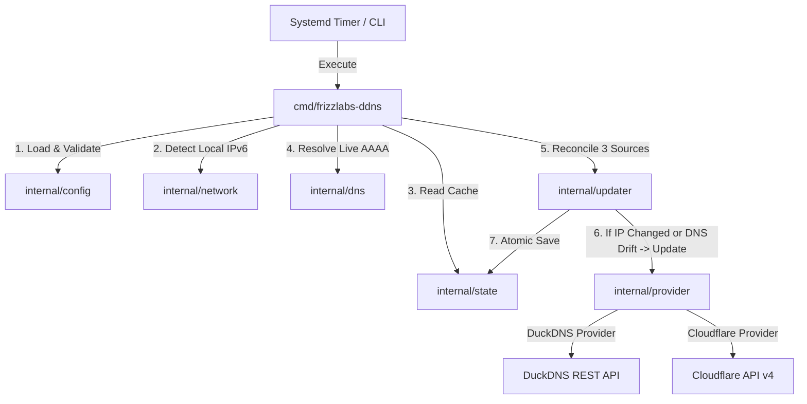

# Architecture Overview - frizzlabs-ddns

`frizzlabs-ddns` is designed following **Clean Architecture**, **SOLID principles**, and **idiomatic Go patterns**.

It is constructed as a lightweight, single-execution daemon (oneshot model) triggered periodically by systemd timers.

---

## Design Rationale: Why Go over Python/Shell?

`frizzlabs-ddns` was specifically implemented in Go to overcome common issues with scripting language daemons:
- **No Dependency Overhead**: Python daemons require a full Python 3 runtime, virtual environments (`venv`), and package managers (`pip`). A single Go binary runs natively with **zero dependencies**.
- **Minimal Resource Footprint**: Starts in **< 5ms** using **< 5MB RAM** (versus Python which consumes 30MB+ RAM for interpreter startup).
- **Supply-Chain Security**: Eliminates third-party package vulnerabilities by relying exclusively on Go's standard library (`net/netip`, `net/http`, `log/slog`, `encoding/json`).

---

## High-Level Architecture Diagram



---

## Key Modules & Contracts

### 1. Provider Interface (`internal/provider`)

The `Provider` interface abstracts DNS record modification. New DNS providers (e.g. Porkbun, Namecheap) can be added by implementing this contract without modifying any reconciliation logic:

```go
type Provider interface {
    Name() string
    Update(ctx context.Context, ipv6 netip.Addr) error
}
```

### 2. Network Address Detector (`internal/network`)

Uses `net/netip` to inspect interface addresses and parse Linux IPv6 routing tables (`/proc/net/ipv6_route`).

#### IPv6 Address Filtering Rules
- Must be a valid IPv6 address (`addr.Is6()`).
- Excludes IPv4-mapped IPv6 addresses (`!addr.Is4In6()`).
- Excludes Loopback (`::1`), Link-Local (`fe80::/10`), Multicast (`ff00::/8`), and Unspecified (`::`).
- Excludes Unique Local Addresses (ULA, `fc00::/7`).

### 3. State Management (`internal/state`)

State is cached in JSON format containing:
- `version`: Schema versioning.
- `provider`: Provider name.
- `lastIPv6`: Last set global IPv6 address string.
- `lastUpdated`: RFC3339 timestamp.

**Atomic File Writes**: State modifications are written to a temporary file (`state-*.tmp`), flushed to disk via `fsync`, and atomically renamed to the destination state file path.

### 4. Reconciliation Engine (`internal/updater`)

- Detects current IPv6 address.
- Loads cached state.
- Skips DNS API calls if the address is unchanged.
- Executes provider updates with **250ms, 500ms, and 1000ms backoff retries** upon network failure.
